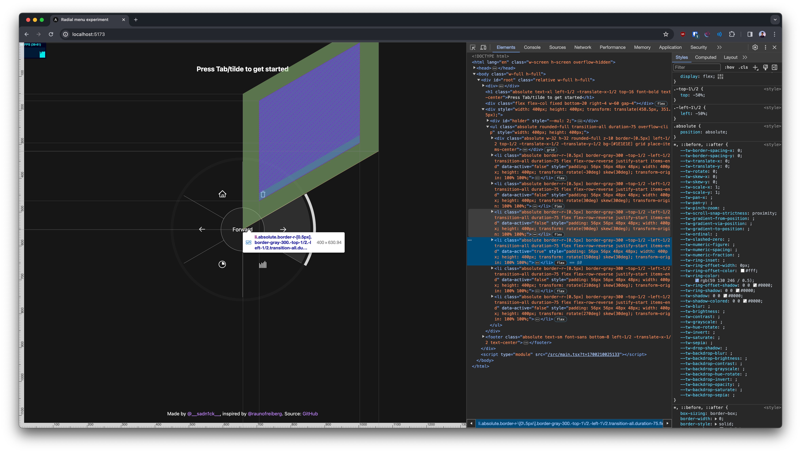

# Radial Menu Experiment

> Video game-ish radial menu, inspired by [@raunofreiberg](https://github.com/raunofreiberg)

## How the tricky parts work

- Each radial menu item is a div positioned at the same place
- Each item is then rotated + skewed using CSS transforms to form a parallelogram-ish shape

- After that, using CSS masks, everything outside the visible circle is cropped out
- A border is applied which uses conic gradients (& maths) to show the border color only on the menu item's area

## Result

<video src="./docs/radial.mp4" width="100%" />
